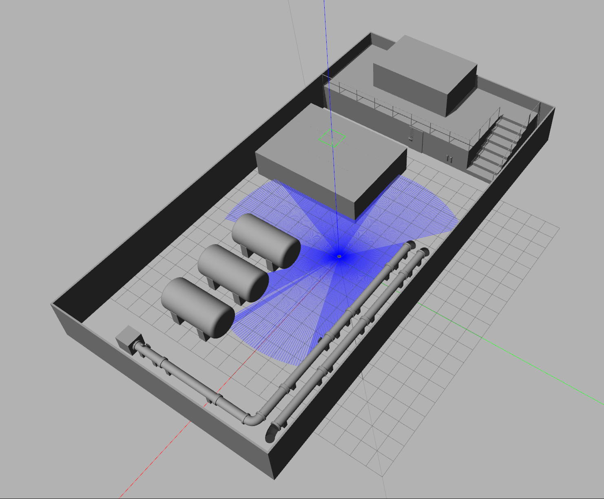

## Automatic Patrol Robot Based on ROS 2 and Navigation 2
<p align="center">
  
</p>

## 1. Project Introduction

This project implements an automatic patrol robot simulation based on ROS 2 and Navigation 2, which is designed for inspection tasks in industrial scenarios such as the H2Mare offshore platform.

The patrol robot is able to move cyclically among different target points. After reaching each target point, it captures a real time image through the camera and saves it locally.

The functions of each package are as follows:
- fishbot_description Robot description files, including simulation related configurations
- fishbot_navigation2 Robot navigation configuration files
- fishbot_application Python code for robot navigation applications
- autopatrol_robot Package for implementing the automatic patrol function

## 2. Usage

The development platform information for this project is as follows:

- System version: Ubuntu 20.04
- ROS version: ROS 2 Galactic

### 2.1 Installation

This project uses slam-toolbox for mapping, Navigation 2 for navigation, Gazebo for simulation, and ros2-control for motion control. Before building, please install the dependencies with the following commands:

1. Install SLAM and Navigation 2

```shell
sudo apt install ros-$ROS_DISTRO-nav2-bringup ros-$ROS_DISTRO-slam-toolbox
```

2.  Install simulation related packages

```shell
sudo apt install ros-$ROS_DISTRO-robot-state-publisher  ros-$ROS_DISTRO-joint-state-publisher ros-$ROS_DISTRO-gazebo-ros-pkgs ros-$ROS_DISTRO-ros2-controllers ros-$ROS_DISTRO-xacro
```
3. Install image related packages

```
sudo apt install python3-pip  -y
sudo apt install espeak-ng -y
sudo pip3 install espeakng
sudo apt install ros-$ROS_DISTRO-tf-transformations
sudo pip3 install transforms3d
```

### Running

After installing the dependencies, you can use colcon to build and run the project.

Build packages

```
colcon build
```

### Run simulation

```
source install/setup.bash
ros2 launch fishbot_description gazebo_sim.launch.py
```

### Run navigation

```
source install/setup.bash
ros2 launch fishbot_navigation2 navigation2.launch.py
```

### Run automatic patrol

```
source install/setup.bash
ros2 launch autopatrol_robot autopatrol.launch.py
```

## 3. Acknowledgements
This project was built with reference to the teaching videos of the Bilibili creator YXros, special thanks for his contributions.

## 4. Author
- [Eiche](https://gitee.com/eiche1206)
- E-mail: weiwang.de@outlook.com


---
## 基于 ROS 2 和 Navigation 2 自动巡检机器人

## 1.项目介绍

本项目基于 ROS 2 和  Navigation 2 设计了一个自动巡检机器人仿真功能， 用来巡检工业场景，如H2Mare海上平台。

该巡检机器人要能够在不同的目标点之间进行循环移动，每到达一个目标点后通过摄像头采集一张实时的图像并保存到本地。

各功能包功能如下：
- fishbot_description 机器人描述文件，包含仿真相关配置
- fishbot_navigation2 机器人导航配置文件
- fishbot_application 机器人导航应用 Python 代码
- autopatrol_robot  自动巡检实现功能包

## 2.使用方法

本项目开发平台信息如下：

- 系统版本： Ubuntu 20.04
- ROS 版本：ROS 2 galactic

### 2.1安装

本项目建图采用 slam-toolbox，导航采用 Navigation 2 ,仿真采用 Gazebo，运动控制采用 ros2-control 实现，构建之前请先安装依赖，指令如下：

1. 安装 SLAM 和 Navigation 2

```shell
sudo apt install ros-$ROS_DISTRO-nav2-bringup ros-$ROS_DISTRO-slam-toolbox
```

2. 安装仿真相关功能包

```shell
sudo apt install ros-$ROS_DISTRO-robot-state-publisher  ros-$ROS_DISTRO-joint-state-publisher ros-$ROS_DISTRO-gazebo-ros-pkgs ros-$ROS_DISTRO-ros2-controllers ros-$ROS_DISTRO-xacro
```

3. 安装图像相关功能包

```
sudo apt install python3-pip  -y
sudo apt install espeak-ng -y
sudo pip3 install espeakng
sudo apt install ros-$ROS_DISTRO-tf-transformations
sudo pip3 install transforms3d
```

### 2.2运行

安装完成依赖后，可以使用 colcon 工具进行构建和运行。

构建功能包

```
colcon build
```

运行仿真

```
source install/setup.bash
ros2 launch fishbot_description gazebo_sim.launch.py
```

运行导航

```
source install/setup.bash
ros2 launch fishbot_navigation2 navigation2.launch.py
```

运行自动巡检

```
source install/setup.bash
ros2 launch autopatrol_robot autopatrol.launch.py
```

## 3.致谢

本项目结合了 Bilibili UP 主 **YXros** 的教学视频进行搭建，在此表示感谢。  
视频链接：<https://www.bilibili.com/video/BV1k5dNYPEdo/?spm_id_from=333.337.search-card.all.click&vd_source=5d7f73275cae0c60565c038e37fd8dd6>


## 4.作者

- [Eiche](https://gitee.com/eiche1206)
- E-mail: weiwang.de@outlook.com
